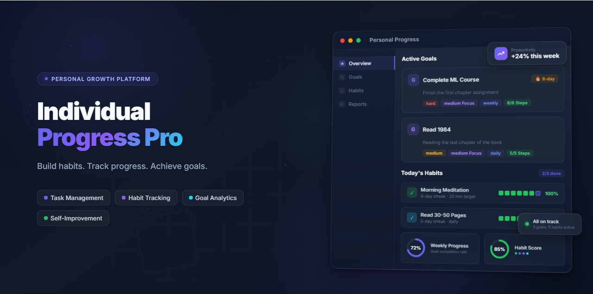

# Individual Progress Pro

[]()
[]()
[]()

> A psychology-informed progressive web application designed to bridge the gap between intention and lasting behavior change.



## 📖 Overview

**Individual Progress Pro** is not just another to-do list. It is a personal behavior-change platform built on cognitive science principles. While conventional productivity tools focus narrowly on task completion, this application models the full lifecycle of behavior change—from defining *why* a goal matters, through structured planning and execution, to regular reflection and recovery.

Drawing on **self-determination theory**, **implementation intentions**, **habit formation research**, and **cognitive load theory**, the app creates an environment that encourages consistency without punishing setbacks. 

**The core philosophy is simple:**
> *Small actions, repeated consistently, create meaningful progress.*

---

## 📑 Table of Contents

- [✨ Key Features](#-key-features)
- [🛠️ Tech Stack](#-tech-stack)
- [🏗️ Architecture & Data Flow](#-architecture--data-flow)
- [🚀 Getting Started](#-getting-started)
  - [Prerequisites](#prerequisites)
  - [Installation](#installation)
- [💡 Usage](#-usage)
  - [For Users](#for-users)
  - [For Developers](#for-developers)
- [⚙️ Configuration](#-configuration)
- [🧪 Current Status](#-current-status)
- [🔮 Future Plans](#-future-plans)
- [🤝 Contributing](#-contributing)
- [📄 License](#-license)
- [🙏 Acknowledgments](#-acknowledgments)

---

## ✨ Key Features

### User Experience & Interface
- **Psychology-Based Creation Wizard:** A multi-step animated modal (featuring a Three.js particle background) that guides users through goal or habit creation one question at a time—emphasizing purpose, obstacle anticipation, and fallback strategies.
- **Dashboard Overview:** Priority-bucketed summaries of pending commitments with onboarding support and contextual greetings.
- **Dark/Light Themes:** Persisted CSS-variable-based theming for comfortable viewing.
- **Bilingual Interface:** Full English and Farsi support, including automated Right-to-Left (RTL) layout handling.
- **PWA & Offline Support:** Service worker with caching enables offline use and home-screen installation.

### Goal & Habit Management
- **Goal Management:** Structured action plans with nested actions, progress bars, deadlines, difficulty ratings, and completion criteria.
- **Habit Tracking:** Identity-based habits with consistency scoring, streak badges, weekly trackers, and flexible three-tier status controls (*missed / minimum / ideal*).

### Analytics & Reporting
- **Weekly Reports:** Publishable summaries with CSV data export and unsaved-changes protection.
- **Visual Analytics:** Chart.js visualizations displaying category distribution and daily progress trends.

---

## 🛠️ Tech Stack

| Technology | Purpose |
|---|---|
| **Next.js** | React framework and application structure |
| **React** | UI development, Context API, Reducers |
| **JavaScript** | Application logic |
| **CSS Variables** | Styling, theming, and design system |
| **Three.js** | Particle background in Creation Wizard |
| **Chart.js** | Analytics and data visualization |
| **LocalStorage** | Client-side persistence (No backend required) |

---

## 🏗️ Architecture & Data Flow

The project is a client-side Next.js application with no server-side backend. All data is persisted in the browser via localStorage.

### Component Structure

```text
src
│
├── app                 # Next.js App Router
│   ├── overview        # Dashboard & summary views
│   ├── goals           # Goal management views
│   ├── habits          # Habit management views
│   └── reports         # Weekly reports & analytics
│
├── components          # UI Components
│   ├── AppShell        # Responsive layout, sidebar, header, FAB
│   ├── CreationWizard  # Multi-step animated modal with Three.js
│   ├── GoalCard        # Goal display & interaction
│   ├── HabitCard       # Habit display & interaction
│   └── Charts          # Chart.js visualizations
│
├── contexts            # State Management
│   ├── CommitmentsCtx  # Unified goals/habits state + reducer
│   ├── ThemeCtx        # Dark/Light mode persistence
│   └── LocaleCtx       # English/Farsi switching & RTL logic
│
├── services            # Data Layer
│   └── localStorageAPI # Standardized CRUD with validation
│
├── utils               # Reusable utilities
│
└── locales             # i18n JSON files (En, Fa)
```

### Data Flow

1. **Input:** Users launch the Creation Wizard via the floating action button (FAB).
2. **Processing:** Collected data flows through the service layer into the central `CommitmentsContext`.
3. **Persistence:** The Context synchronizes the unified commitments array to `localStorage` on every state change.
4. **Rendering:** The Dashboard and item views read from `CommitmentsContext` to render current data. Status changes, edits, and deletions trigger immediate re-persistence.
5. **Reporting:** The Reports module pulls historical completion data for Chart.js visualization and CSV export.

---

## 🚀 Getting Started

### Prerequisites

Before you begin, ensure you have the following installed:
- **Node.js** (v18.x or later recommended)
- **npm**, **yarn**, or **pnpm** package manager
- **Git**

### Installation

Follow these steps to set up the project locally:

1. **Clone the repository:**
   ```bash
   git clone https://github.com/your-username/individual-progress-pro.git
   ```

2. **Navigate to the project directory:**
   ```bash
   cd individual-progress-pro
   ```

3. **Install dependencies:**
   ```bash
   npm install
   # or
   yarn install
   ```

4. **Start the development server:**
   ```bash
   npm run dev
   # or
   yarn dev
   ```

5. **Open the application:**
   Open your browser and navigate to `http://localhost:3000`.

---

## 💡 Usage

### For Users

1. **Onboarding:** Upon first launch, the dashboard provides an onboarding guide.
2. **Creating Commitments:** Click the **Floating Action Button** (FAB) at the bottom right. The Creation Wizard will guide you step-by-step through defining your motivation, planning, and setting difficulty/obstacles.
3. **Daily Tracking:** Navigate to **Habits** to log daily status (*missed, minimum, ideal*). Navigate to **Goals** to tick off nested action steps.
4. **Reviewing Progress:** Visit the **Reports** view to view weekly charts, publish a weekly summary, or export your data as a CSV.

### For Developers

The data layer is decoupled from UI components to make future backend migration easier. You can interact with the data service directly if extending the app:

```javascript
import { localStorageAPI } from '@/services/localStorageAPI';

// Example: Fetching all goals
const response = localStorageAPI.getItems('goals');
if (response.success) {
  console.log(response.data);
}

// Example: Creating a new habit
const newHabit = { 
  title: "Read 10 pages", 
  identityStatement: "I am a reader", 
  frequency: "daily" 
};
const createResponse = localStorageAPI.createItem('habits', newHabit);
```

---

## ⚙️ Configuration

The application handles configuration dynamically through the User Interface:

- **Theme:** Toggle between Dark and Light modes via the header. Preferences are persisted in `localStorage`.
- **Language:** Switch between English and Farsi via the UI. The application automatically applies RTL (Right-to-Left) layout directives for Farsi.
- **Locale Files:** To modify translations, edit the JSON files located in `src/locales/`.

---

## 🧪 Current Status

🚧 The project is currently under **active development**.

**Completed:**
- [x] LocalStorage CRUD system & Data abstraction layer
- [x] Psychology-based Creation Wizard (with Three.js UI)
- [x] Goal & Habit management foundations & UI
- [x] Dashboard overview & contextual greetings
- [x] Chart.js analytics & weekly reports (with CSV export)
- [x] PWA setup & offline caching
- [x] Bilingual support (English/Farsi + RTL)
- [x] Dark/Light theme persistence

**In Progress:**
- [ ] Advanced progress insights & analytics
- [ ] Polish and edge-case handling for Creation Wizard

---

## 🔮 Future Plans

### Version 2 (Backend & Sync)
- Backend API integration (Node/Express or similar)
- User authentication
- Cloud synchronization & database integration
- Multi-device support

### Version 3 (Intelligence)
- AI productivity assistant
- Smart recommendations based on completion data
- Personalized, dynamic improvement plans
- Advanced behavioral analytics

---

## 🤝 Contributing

This project is currently a personal learning and portfolio endeavor. While formal code contributions are not being actively sought at this moment, **suggestions, feedback, and feature ideas are highly welcome**. 

If you find a bug or have an idea to improve the psychological modeling, please feel free to open an Issue in the repository.

---

## 📄 License

*Note: A formal license has not yet been specified for this project. Please check back later or contact the author for usage rights.*

---

## 🙏 Acknowledgments

- **Cognitive Science & Psychology:** The design of this application is heavily inspired by research in *Self-Determination Theory*, *Implementation Intentions* (Peter Gollwitzer), *Habit Formation* (James Clear, BJ Fogg), and *Cognitive Load Theory*.
- **Open Source Libraries:** Gratitude to the maintainers of Next.js, React, Three.js, and Chart.js for making modern web development accessible and powerful.